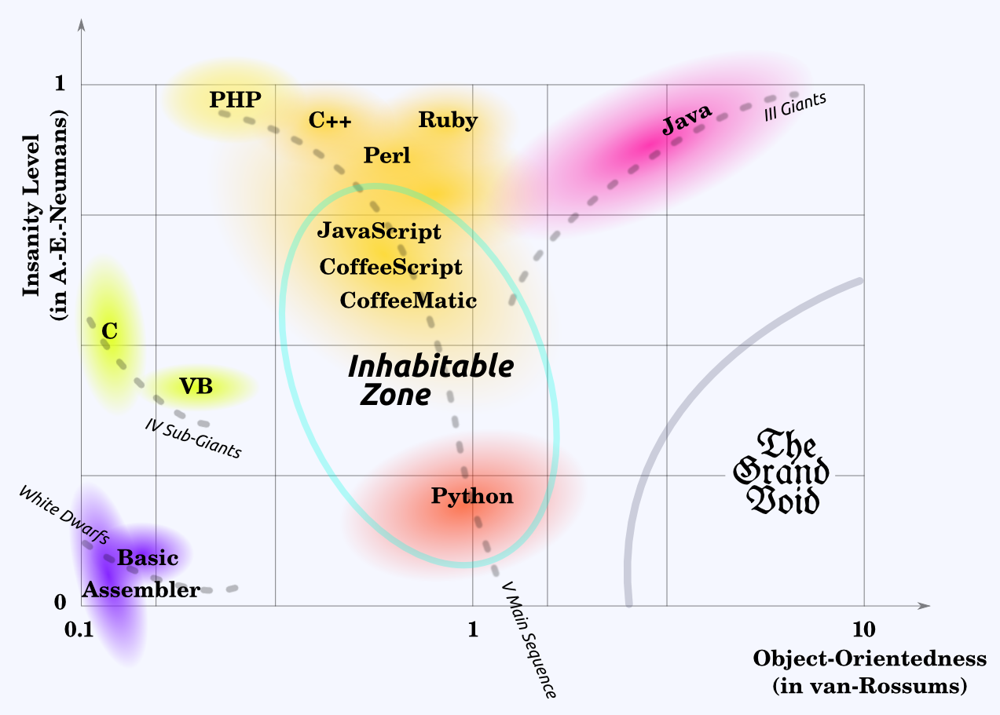

# CoffeeNode, an Application Basework

>   "JavaScript is too important to be left to the experts."—*Jeremy
>   Ashkenas, creator of CoffeeScript*

############################################################################################################

# Prelude

## What Made me Leave Python after 10 Years of Loving it

*   I earned the *Popular Question* badge on StackOverflow.com 3 times:

    *   Is it possible to use **re2** from Python? (2010)

    *   how to install **pycairo for python 3** on Ubuntu 10.04? (2011)

    *   how to do **asynchronous http** requests with epoll and **python 3.1**? (2010)

*   all questions were hard—3373 views in 33 months generated only 10 answers total or 3⅓ answers per.
    That's 3 views per day, but only one answer in 3 days.

*   Realize something?

*   All questions remained essentially unanswered

*   and the last one did it.

*   Good riddance, good bye

*   Helo NodeJS

>    (see [http://stackoverflow.com/questions/2439345](http://stackoverflow.com/questions/2439345),
>    [6232529](http://stackoverflow.com/questions/6232529),
>    and [2489780](http://stackoverflow.com/questions/2489780))

############################################################################################################

# Prelude

##  What Made me Leave OOP after 10 Years of Trying to Love it

*   to quote:

>   "The last step forward was object-oriented programming [...] the next step is all overdue: we
>   should've been there by now and we haven't—we're still in the object-oriented stage."—[Douglas
>   Crockford, *Web Forward*, keynote to the 2008 Frontend Engineering Summit at
>   Yahoo!](http://www.youtube.com/watch?v=yh7TeoEwNyI)

>   "Object Oriented Programming puts the Nouns first and foremost. Why
>   would you go to such lengths to put one part of speech on a pedestal?
>   Why should one kind of concept take precedence over another? It's not
>   as if OOP has suddenly made verbs less important in the way we
>   actually think. It's a strangely skewed perspective."---[Steve Yegge,
>   *Execution in the Kingdom of Nouns*](http://steve-yegge.blogspot.com/2006/03/execution-in-kingdom-of-nouns.html)

*   This is Java, unmistakably:

        RidersGuild.getRiderNotificationSubscriberList().getBroadcaster().run(
          new BroadcastMessage(StableFactory.getNullHorseInstance()));

*   OOP in itself does little to take complexity out of programming—in fact, my impression is that OOP
    *encourages* complexity:

    >   The problems that the [Enterprise JavaBeans] standard was attempting to address, such as
    >   object-relational mapping and transactional integrity, were complex, however many programmers found the
    >   APIs to
    >   be just as difficult, leading to a perception that EJBs introduced complexity without delivering real
    >   benefits.—[Wikipedia](http://en.wikipedia.org/wiki/Enterprise_JavaBeans)

    I could describe my experience with [SQLAlchemy](http://www.sqlalchemy.org/) (a Python ORM toolkit) with
    the exactly same words. ORM is somewhat hard, but in the end i went back to handwritten SQL queries
    (with interpolated variable contents) simply because it was conceptually so much less of a burden.

############################################################################################################

# Approaches to Programming

##  Different Schools of Thought

*   Engineering

*   Architecture

*   Something completely different: 'Computer Science', 'Informatics'

*   Linguistics

############################################################################################################

# Approaches to Programming

## Language is Important

*   Computers don't need readable programs—humans do.

    Literate Programming can provide tools to make organized, beautiful
    source code and documentation, but no amount of CSS can demystify a
    badly chosen variable name.

    >    "Programs are not just a technical contrivance, they are a medium of
    >    intentional communication—with the machine, but more importantly with
    >    your development community, and ultimately with yourself."—Douglas
    >    Crockford, *Quality*, talk delivered on Yahoo!'s internal Frontend
    >    Engineering Summit in 2007,
    >    [http://www.youtube.com/watch?v=t9YLtDJZtPY](http://www.youtube.com/watch?v=t9YLtDJZtPY)

*   This talk is all about enabling programmers to write more readable programs:

    >    "The simplest thing we can do to enhance the value of our codebase is to
    >    make our programs more readable."—Douglas Crockford, *Quality*, talk
    >    delivered on Yahoo!'s internal Frontend Engineering Summit in 2007,
    >    [http://www.youtube.com/watch?v=t9YLtDJZtPY](http://www.youtube.com/watch?v=t9YLtDJZtPY)

############################################################################################################

# Approaches to Programming

## Why you should care about LSD

*   Short for a style of programming that is

    *   Library-Oriented

    *   Semantics-Inspired

    *   Data-Centric

Data-Centric
  ~ When we program, it's all about the data. OOP maintains data should be 'smart', that we should write
    `sesame.open()`. The sesame 'knows' how to 'open' itself, and when we want that to happen, we should
    'send it the message `open`' so it does that.

    Bollocks.

    How about `door.open()`. Magic doors or what? Could as well be `fritz.open( door )`, no?

    I think data should just be data—100% pure state. No additives, please.

Library-Based
  ~ Stateless libraries are the workhorses of LSD. They are cleanly separated from business data. They may
    contain constants and data collections, but they are in most cases not supposed to change during
    run time. They mostly contain nothing but methods. A library is often built to handle one specific
    data type or to perform tasks in one specialized field of concern.

Semantics-Inspired
  ~ As Wittgenstein put it,

    > what can be said at all can be said clearly, and what we cannot talk about we must pass over in silence.

    With 'semantics' i do not here mean the 'semantic' of 'semantic web'. That is just a mirage, a passing
    fad that came and went with XML.

    I'm talking about clarity.

    For there to arise clarity in a program, the parts of the code should be clear, they should be
    arranged in a clear way, and they should interact in clear ways.

    One reason my programs consist of 99% 'scrabble words'. No abbr. pls.

############################################################################################################

# CoffeeNode Data Type Therapy

## What is a Data Type?

*   A classification of data

*   based on their underlying storage needs (extension)

*   and semantics & use (intention).

############################################################################################################

# CoffeeNode Data Type Therapy

## How are Data Types Represented?

*   In JavaScript, the `typeof` operator returns a string

*   whereas in Python, types are represented by the objects that implement them (the reality is a little
    more complicated).

*   Representing / identifying (classes of) things by texts is straightforward,
    simple, accessible and extensible

*   it works for 7 billion people and their pets

*   it works for the 171,476 words of English (in the OED)

*   so it should be good enough for this purpose.

*   Examples:

    -   built-in JavaScript types:

            'text'
            'number'
            'boolean'
            'jsdate'

    -   CoffeeNode extension types:

            'SET/set'
            'HTML/document'

    -   3rd party types:

            'example.com/FOO/bar'

############################################################################################################

# CoffeeNode Data Type Therapy

## JS Type Checking—Is it Good Enough?

*   Short answer: No.

*   Long answer:

    *   these work:

        `value =`        `typeof value`
        ---------------- ---------------
        `true`           `'boolean'`
        `->`             `'function'`
        `'text'`         `'string'`
        `undefined`      `'undefined'`
        `new Object()`   `'object'`
        `42`             `'number'`

    *   this is doubtful:

        `value =`        `typeof value`
        ---------------- ---------------
        `Infinity`       `'number'`

    *   this is troublesome:

        `value =`        `typeof value`
        ---------------- ---------------
        `NaN`            `'number'`

    *   and the rest is silence, painful silence:

        `value =`        `typeof value`
        ---------------- ---------------
        `[]`             `'object'`
        `{}`             `'object'`
        `new Date()`     `'object'`
        `global`         `'object'`
        `new RegExp()`   `'object'`
        `new Error()`    `'object'`
        `arguments`      `'object'`
        `null`           `'object'`

*   Likewise, the `instanceof` operator is deeply broken:

    *   these are OK:

            typeof 42 == 'number'                   # true
            ( new Number 42 ) instanceof Number     # true
            NaN instanceof Number                   # false

    *   these are nuts:

            typeof NaN == 'number'                  # true
            42 instanceof Number                    # false

*   Testing whether a result is a number or not is really important in JavaScript because `1 / 0` and
    `1 * 'foo'` yield `Infinity` and `NaN`, respectively.

*   ⚞OMFG⚟

############################################################################################################

# CoffeeNode Data Type Therapy

## Remedy: The Miller Device

*   Fortunately, there is a `toString` method in `Object.protype` that behaves a tad more civilized:

value            `Object::toString.call value`
---------------- -------------------------------
`true`           `[object Boolean]`
`->`             `[object Function]`
`'text'`         `[object String]`
`undefined`      `[object Undefined]`
`42`             `[object Number]`
`Infinity`       `[object Number]`
`NaN`            `[object Number]`
`[]`             `[object Array]`
`{}`             `[object Object]`
`new Date()`     `[object Date]`
`global`         `[object global]`
`new RegExp()`   `[object RegExp]`
`new Error()`    `[object Error]`
`arguments`      `[object Arguments]`
`null`           `[object Null]`

: Return values of `Object::toString`

############################################################################################################

# CoffeeNode Data Type Therapy

## Remedy: The Miller Device

*   We exploit the goodness of the Miller Device to arrive at a sane type system. From
    `COFFEENODE/TYPES.coffee`:

        #---------------------------------------------------------------------------------------------
        js_type_of = ( x ) ->
          return Object.prototype::call x

        #---------------------------------------------------------------------------------------------
        $.isa_list          = ( x ) -> return ( js_type_of x ) == '[object Array]'
        $.isa_boolean       = ( x ) -> return ( js_type_of x ) == '[object Boolean]'
        $.isa_function      = ( x ) -> return ( js_type_of x ) == '[object Function]'
        $.isa_pod           = ( x ) -> return ( js_type_of x ) == '[object Object]'
        $.isa_text          = ( x ) -> return ( js_type_of x ) == '[object String]'
        $.isa_number        = ( x ) -> return ( js_type_of x ) == '[object Number]' and isFinite x
        $.isa_infinity      = ( x ) -> return x == Infinity or x == -Infinity
        $.isa_null          = ( x ) -> return x is null
        #.............................................................................................
        $.isa_jsundefined   = ( x ) -> return x is undefined
        $.isa_jsnotanumber  = ( x ) -> return isNaN x
        $.isa_jsarguments   = ( x ) -> return ( js_type_of x ) == '[object Arguments]'
        $.isa_jsdate        = ( x ) -> return ( js_type_of x ) == '[object Date]'
        $.isa_jsglobal      = ( x ) -> return ( js_type_of x ) == '[object global]'
        $.isa_jsregex       = ( x ) -> return ( js_type_of x ) == '[object RegExp]'
        $.isa_jserror       = ( x ) -> return ( js_type_of x ) == '[object Error]'
        $.isa_jswindow      = ( x ) -> return ( js_type_of x ) == '[object DOMWindow]'
        $.isa_jsctx         = ( x ) -> return ( js_type_of x ) == '[object CanvasRenderingContext2D]'
        $.isa_jsarraybuffer = ( x ) -> return ( js_type_of x ) == '[object ArrayBuffer]'

        #---------------------------------------------------------------------------------------------
        coffeenode_type_by_js_type =
          '[object Array]':                     'list'
          '[object Boolean]':                   'boolean'
          '[object Function]':                  'function'
          '[object Null]':                      'null'
          '[object String]':                    'text'
          '[object Object]':                    'pod'
          #...........................................................................................
          '[object Undefined]':                 'jsundefined'
          '[object Arguments]':                 'jsarguments'
          '[object Date]':                      'jsdate'
          '[object Error]':                     'jserror'
          '[object global]':                    'jsglobal'
          '[object RegExp]':                    'jsregex'
          '[object DOMWindow]':                 'jswindow'
          '[object CanvasRenderingContext2D]':  'jsctx'
          '[object ArrayBuffer]':               'jsarraybuffer'
          #...........................................................................................
          '[object Number]': ( x ) ->
            return 'jsnotanumber' if isNaN x
            return 'jsinfinity'   if x == Infinity or x == -Infinity
            return 'number'

        # **NB**: this is the preliminary version of `type_of`; the final version is shown later.

        #---------------------------------------------------------------------------------------------
        $.type_of = ( x ) ->
          """Given any kind of value ``x``, return its type."""
          R = coffeenode_type_by_js_type[ js_type_of x ]
          unless R? then throw new Error "unable to determine type of #{rpr x}"
          return if @isa_function R then R x else R

*   Usage:

        log type_of        1 / 0            # jsinfinity
        log isa_jsinfinity 1 / 0            # true
        log isa_number     1 / 0            # false

############################################################################################################

# Type Hierarchy (and what we can do with it)

## Native JavaScript Types

*   The native JavaScript data types are divided into three groups:

*   The first group contains all the 'universally accepted' data types;
    there are seven of these, all of which (except `function`) are
    directly representable in JSON. I call this set the 'basic' data types:

    *   `list`
    *   `boolean`
    *   `function`
    *   `null`
    *   `text`
    *   `pod`
    *   `number`

*   The second group contains data types that are not nearly as
    universally accepted across languages, but they are present in all modern JavaScript VMs.

    **NB** that while the *types* `jsnotanumber` and `jsinfinity` are introduced by CoffeeNode,
    the *values* are available in all JS VMs:

    *   `jsundefined`
    *   `jsarguments`
    *   `jsdate`
    *   `jserror`
    *   `jsglobal`
    *   `jsregex`
    *   `jsnotanumber`
    *   `jsinfinity`

*   The third group contains data types that may only be present in some
    environments, depending e.g. you're running code in NodeJS on the
    server or in, say, on SpiderMonkey in Firefox:

    *   `jsglobal`
    *   `jswindow`
    *   `jsctx`
    *   `jsarraybuffer`

############################################################################################################

# Type Hierarchy (and what we can do with it)

## Issues with Native Types

*   A ~~short~~ TL;DR discussion of issues with JS data
    types:

`jsundefined`
  ~ ... it's OK to have a value to represent something that doesn't exist,
    but it's not cool to make one value represent a number of completely unrelated
    code quality issues:

        f = ( x, y ) ->
            bye 'no value given for y' unless y?

        d = { a: 42 }
        f d[ 'a' ]                  # fails because `f` was called with too few arguments
        f d[ 'a' ], d[ 'b' ]        # fails because `d` has no member `b`

`jsnotanumber`
  ~ ... `NaN`, which appears as the result of some bogus operations, such
    as adding a number and a text that does not 'look like' a number;
    this value is crazy to the point it identifies itself as a number.
    Don't touch, move on.

`jsinfinity`
  ~ ... appears as the result of some other bogus operations, such as

    *   `1 / 0` (Wikipedia: "Division by zero must be left undefined in any
        mathematical system that obeys the axioms of a field."),
    *   `Math.max()` (how many apples does the fullest basket contain if there are no baskets?).

`jsarguments`
  ~ ... a strange thing that wants to be a list ever so badly; it is
    sometimes very practical to have, but is missing from competing
    languages and will in a few years get removed from JavaScript, too.

`jsdate`
  ~ ... which is extremely difficult to handle correctly, and full of subtle bugs.

`jserror`
  ~ ... the one data type in this group that looks OK.

`jsregex`
  ~ ... full of strange API decisions, bugs and unfixable shortcomings—see
    [http://blog.stevenlevithan.com](http://blog.stevenlevithan.com).

############################################################################################################

# Type Hierarchy (and what we can do with it)

## Equality? Nope.

*   CoffeeNode tries to make programming in JavaScript easier
    and more fun, and to enhance program correctness.

*   Among the basic things that don't work very well in plain JavaScript
    are equality and containedness with collection data types

*   which means that `[] === []` and `{} === {}` are `false` when they should be `true`;

*   also, `[ 456, 893, [ 5, 6, 7, ], ].indexOf [ 5, 6, 7, ]` gives `-1` ('not found') instead of `2`.

*   JavaScript's `===` (CoffeeScript: `==`) 'strict equality operator' is more like a 'object identity
    operator'

############################################################################################################

# Type Hierarchy (and what we can do with it)

## Example Code: `LIST/equals`

*   How can we fix equality and containment?

*   Sadly, there is no way to override the behavior of ``==`` and ``===``.

*   It isn't advisable, either—such a global language change could easily affect
    code acting under the premise that

        ( [] === [] ) === false

*   Don't Monkey-Patch. Ever. Except if.

*   So we have to put the functionality into libraries.

*   **Example**: from `COFFEENODE/jstypes/LIST/implementation.coffee` (**NB** this code is from the
    *implementation* submodule of `LIST`—you'd ordinarily call `LIST/main.cnd/equality`, which is a
    wrapper that checks argument number and that `me` is a `list`, and then returns the result of
    calling the below method):

        #---------------------------------------------------------------------------------------------
        $.equals = ( me, you ) ->

          return false if not TYPES.isa_list you
          return false if me.length != you.length
          return true  if me.length == 0

          #...........................................................................................
          for idx in [ 0 ... me.length ]

            #.........................................................................................
            my_element      = me[  idx ]
            your_element    = you[ idx ]

            return false if ( TYPES.type_of my_element ) != ( TYPES.type_of your_element )
            return false if not Σ.emit "!Δ/call/specific/equals", my_element, your_element

          #...........................................................................................
          return true

*   The magic happens in the Σ library

*   which lives at <https://github.com/loveencounterflow/COFFEENODE-SIGMA>

*   and is a synchronous signal handling library.

*   More later.

############################################################################################################

# Type Hierarchy (and what we can do with it)

## Example Code: `LIST/contains`

*   From `COFFEENODE/jstypes/LIST/implementation.coffee`:

        #---------------------------------------------------------------------------------------------
        $.contains = ( me, probe ) ->

          #...........................................................................................
          # If ``List.indexOf`` reports a hit, we definitely know it is so and return ``true``:

          return true if ( me.indexOf probe ) > -1

          #...........................................................................................
          # We know the miss is authoritative if ``probe`` can be equality-tested with JavaScript's
          # ``===`` operator:

          type_of_probe = TYPES.type_of probe
          return false if TYPES.simple_equality_types[ type_of_probe ]

          #...........................................................................................
          for value in me
            type_of_value = TYPES.type_of value

            #.........................................................................................
            # We can trivially skip ahead if
            # * the type of the value and the type of the probe differ
            # * or if the value type is on the 'simple equality' list:

            continue if type_of_value isnt type_of_probe
            continue if TYPES.simple_equality_types[ type_of_value ]

            #.........................................................................................
            return true if Σ.emit "!Δ/call/specific/equals", probe, value

          #...........................................................................................
          return false

############################################################################################################

# Type Hierarchy (and what we can do with it)

## JavaScript Types are a Closed Set

*   *Each* piece of data has exactly one type.

*   Types are disjunct: if ``( type_of a ) == A`` and ``( type_of a ) == B`` are true, then ``A == B``
    must also be true.

*   In JavaScript (and, therefore, CoffeeScript) this data type can only ever
    be one of

    *   `list`
    *   `boolean`
    *   `function`
    *   `null`
    *   `text`
    *   `pod`
    *   `number`
    *   `jsarguments`
    *   `jsdate`
    *   `jserror`
    *   `jsglobal`
    *   `jsregex`
    *   `jsnotanumber`
    *   `jsinfinity`

*   Additionally, though, JavaScript may have a number of host object data types:

    *   `jsglobal`
    *   `jswindow`
    *   `jsctx`

*   (plus some things we omitted here, like an image on an HTML page).

*   You would have to write some C extension to your JavaScript VM to
    add a type

*   but whatever VM you use, the available types form a closed set at run time.
    And most added objects don't bother for typing; they just 'look like' ordinary
    plain objects, so you would have to inspect attributes to classify them.

############################################################################################################

# Type Hierarchy (and what we can do with it)

## Extended Types

*   But JavaScript is very flexible, so you can build arbitrary objects.
    From `COFFEENODE/SET`:

        #---------------------------------------------------------------------------------------------
        $.new = ( x = null ) ->
          """Given any number of elements, return a set containing these elements."""

          #...........................................................................................
          elements = {}
          R        =
            '~isa':                   'SET/set'
            'elements':               elements

          #...........................................................................................
          if x?
            type = TYPES.type_of x
            unless TYPES.is_facetted x then bye "need a collection, got a #{type}"

            #.........................................................................................
            switch type
              #.......................................................................................
              when 'list', 'text'
                for element in x
                  elements[ HASH.as_hash_key element ] = 1
              #.......................................................................................
              when 'pod'
                for name, value of x
                  elements[ HASH.as_hash_key value ] = 1
              #.......................................................................................
              else
                return Σ.emit '!Δ/call/specific/as_set', x

          #...........................................................................................
          return R

############################################################################################################

# Type Hierarchy (and what we can do with it)

## Using `Set.new`

*   Using the `SET` library, we can create and manipulate sets:

        SET.new 'helo world'

    gives you

        {   ~isa:     'SET/set'
            elements:
              h:      1
              e:      1
              l:      1
              o:      1
              ' ':    1
              w:      1
              r:      1
              d:      1
              }

*   which is basically a plain old dictionary (POD) that gives its extension type as a name under
    the key `~isa`

*   and contains a sub-POD `elements` that keeps the records.

############################################################################################################

# Type Hierarchy (and what we can do with it)

## Using `type_of`

*   This is the updated `type_of` method that recognizes extension types:

        #---------------------------------------------------------------------------------------------
        $.type_of = ( x ) ->
          #...........................................................................................
          validate_argument_count_equals 1
          #...........................................................................................
          return 'null'         if x is null
          return 'jsundefined'  if x is undefined
          #...........................................................................................
          R = x[ '~isa' ]
          return R if R?
          #...........................................................................................
          R = coffeenode_type_by_js_type[ js_type_of x ]
          unless R? then throw new Error "unable to determine type of #{rpr x}"
          return if @isa_function R then R x else R

*   And it works:

        x = SET.new [ 'a', 'b', 'c' ]
        log TYPES.type_of x                     # 'SET/set'
        log TYPES.isa x, 'SET/set'              # true
        log TYPES.isa x, 'pod'                  # false

        log SET.contains x, 'a'                 # true
        log SET.contains x, 'x'                 # false

        log SET.length_of x                     # 3

*   This looks very object-oriented, but is conceptually different.

*   The common conception of OOP methods is that they take an amplicit first argument, which is the
    object instance that the method is called on; in Python, this is the semi-explicit `self` parameter,
    while in JavaScript, it's the fully implicit `this`:

        def f( self, x, y ):
          return self.sum( x, y ) * 42

        this.f = function ( x, y ) {
          return this.sum( x, y ) * 42; }

*   It's a little annoying to always having to write out the relevant library name.

*   Mainly to avoid this and also to get some other features, there are CoffeeMatic (`*.cmat`) files,
    which are simply augmented CoffeeScript files.
    I'll come back to those later. Preview:

        x = new_set [ 'a', 'b', 'c' ]
        log type_of x                     # 'SET/set'
        log isa x, 'SET/set'              # true
        log isa x, 'pod'                  # false

        log contains x, 'a'               # true
        log contains x, 'x'               # false

        log length_of x                   # 3

############################################################################################################

# Type Hierarchy (and what we can do with it)

## Having Fun with Sets

*   A real advantage over using Plain Old JavaScript Objects directly for sets is the type-safety of
    CoffeeNode sets:

        log SET.new [ 98765.432, null, true, 'abc', ]

    gives

        {   ~isa:                 'SET/set',
            elements:
              '△○□n/98765.432':   1
              '△○□x/null':        1
              '△○□x/true':        1
              'abc':              1
              }

*   JavaScript only ever uses texts for POD keys, but using this sigil we can (with very high certainty)
    ensure that our special strings don't interfere with any other strings.

*   The `△○□` here represent three arbitrarily chosen codepoints from the Unicode Private Use Area (how they
    will actually display will depend on installed fonts). Since the PUA contains 6400 codepoints, is not
    very frequently used, and there are around 262 billion three-character combinations from this block,
    an accidental collision with an actual text that was meant to start this way can be considered
    sufficiently unlikely.

    (The 100% safe alternative would be to prefix *all* keys, including string keys,
    but that would mean a burden on resources for the most useful and most frequent use case for sets and
    PODs.)

*   The `SET/contains` method (which coincides with `SET.has`) is very simple:

        #-----------------------------------------------------------------------------------------
        $.contains = $.has = ( me, probe ) ->
          return me[ 'elements' ][ HASH.as_hash_key probe ] isnt undefined

*   I just discover i should've really written `return POD.contains me[ 'elements' ], probe`

############################################################################################################

# Type Hierarchy (and what we can do with it)

## Type-Checking

*   So what happens if you throw unsuitable data at `SET.new`?—Let's try:

*   `SET.new SET.new 'abc'` gives you

        Error: as_set is applicable to a set, but not implemented in COFFEENODE/jstypes/SET

    This tells you that although a set is a suitable argument to `as_set`, it currently isn't implemented
    (and maybe shouldn't—still pondering this question).

*   How the hell does the system *know* this?

*   `log SET.new 42` gives you

        Error: 'as_set' is not applicable to a number;
        'as_set' requires { +facetted },
        but type 'number' is tagged with { basic, ecma, json, number, numeric }
        and doesn't match the method description.

*   this tells you that in CoffeeNode, data types & kinds are *tagged*.

*   Do you know of any other language / environment that tags data types? I think it's elementary!

############################################################################################################

# Type Hierarchy (and what we can do with it)

##   Tagged Data Types? Are you Kidding?

*   No, really.

*   A list is characterized as

    *   `list`:       each type is tagged with its own name; important for what follows.

    *   `mutable`:    you can modify the object. Frozen lists (tuples) miss this tag.

    *   `facetted`:   meaning you can do the `x[ foo ]` thing.

    *   `indexed`:    meaning the `foo` in `x[ foo ]` must be a number.

    *   `dense`:      a sparse list would be missing this tag.

    *   `ordered`:    unlike a POD, which misses this tag.

    *   `repetitive`: values may be repeated.

    *   `ecma`:       this dignifies everything that is in ECMA's book.

    *   `json`:       this data type can be fed to `JSON.stringify` / `as_json`

    *   `basic`:      this pertains to the six data types earlier shown in the first group of JS native data
        types.

############################################################################################################

# Type Hierarchy (and what we can do with it)

##   Matching Types and Methods

*   A peek into `COFFEENODE/Λ/registry/jstypes`:

        #-----------------------------------------------------------------------------------------
        module.exports = ( require '../_read-registry-jstypes' )
          'boolean':        'ecma json basic'
          'function':       'callable ecma basic'
          'list':           'mutable indexed facetted dense ordered repetitive ecma json basic'
          'null':           'single-valued ecma json basic'
          'number':         'numeric ecma json basic'
          'pod':            'mutable facetted ecma json basic'
          'text':           'indexed facetted dense ordered ecma json basic'
          'jsarguments':    'mutable indexed facetted dense ordered repetitive ecma'
          'jsdate':         'mutable ecma'
          'jserror':        'ecma'
          'jsglobal':       'mutable facetted ecma'
          'jsinfinity':     'single-valued ecma'
          'jsnotanumber':   'ecma'
          'jsregex':        'ecma'
          'jsundefined':    'undefined ecma'

*   A peek into `COFFEENODE/Λ/registry/specific-methods`:

        #-----------------------------------------------------------------------------------------
        module.exports = ( require '../_read-registry-specific-Λ-methods' )
          'add':                        '?facetted ?numeric'
          'first-value-of':             '+ordered'
          'names-of':                   '-indexed +facetted'
          'idxs-of':                    '+indexed'
          'normalize':                  '*'
          'words-of':                   '?text'

*   When a 'type-specific Δ method' is called for, we check whether the description of the type of the first
    argument 'matches' the description of the method:

    *   `?` specifies an **optional tag**—at least one of the optional tags must appear in the type's tags;

    *   `+` specifies a **mandatory tag**—all mandatory tags must appear in the type's tags;

    *   `-` specifies a **forbidden tag**—none of the forbidden tags may appear in the type's tags;

    *   `*` specifies **match any type**—this may not be combined with other tags.

*   The matching process is not fully general, as more complicated patterns are not possible. You cannot
    currently say *match either ( a and b ) or else ( c and d )*. It appears to suffice though.

*   Because each type is tagged with its own name, you always have the choice to match types and methods
    simply by naming the types that the method applies to.

*   This is what happens with `words_of`. One could argue that this method is *much too peculiar to earn
    the distinction of being globally available*, but i strongly feel
    that the vast majority of methods in the `jstypes` library *should* attain that status.

############################################################################################################

# Type Hierarchy (and what we can do with it)

##  Extension Types have Tags, too

*   This is `COFFEENODE/SET/type-descriptions.coffee`:

        module.exports =
          'SET/set':
            'features':             'mutable facetted json'

*   Tagging of extension types ensure that we can go on a smooth path from patching native types to
    integrating extension types.

############################################################################################################

# Type Hierarchy (and what we can do with it)

##   Keeping Peace, Avoiding Conflicts

*   OK so earlier we said that *even if we could fix the JS `===` operator, we shouldn't do that*: **don't
    change global semantics**.

*   Now what happens if one part of your application relies on `new_set 42` to fail miserably, while the
    other half of your brain is just rejoicing about having implemented `NUMBER/as_set`?

*   Because of the way CoffeeNode works, that very much *looks* like a global change, no?

*   And you would be right.

*   But there's help: enlightened reincarnated programmers that spent decades in DLL Hell in their
    earlier lives have enabled NodeJS modules to specify exactly which versions of dependencies
    a given module needs—meaning you can have several versions of the *same* module servicing the
    *same* application.

*   This is great news. I can sleep again. 未來光明。

*   Until i start scratching my head over how to exactly implement that.

*   Some day.

*   BTW we're sort of prepared for that—each CoffeeNode library module is (planned to become) an installable
    entry in the npm module registry and on GitHub.com.

############################################################################################################

#   Comparison of Programming Languages

############################################################################################################

#   Comparison of Programming Languages (cont'd)

*   Some languages are so crazy, you can hardly use them properly if you care for manageable, correct
    algorithms.

*   One example is PHP, which is only marginally less crazy than Brainfuck. You can only write correct
    programs if you read up on 10 years of user discussion revealing bugs and giving workarounds—for each
    single function. Things are not getting fixed in PHP, they get discussed in the online manual. PHP has
    a surprisingly complicated syntax. PHP cannot speak Unicode, so why should you care to speak PHP?

*   Another example is Ruby, whose followers worship Monkey Patching.

*   Another well-known example is Perl, whose gotchas are not oversights or accidents, but intentionally
    built into the language. Here's the reason i never continued to program in Perl:

    *   Assigns `'c'` to `$foo` and throws the rest of the array away:

            $foo = ( 'a', 'b', 'c' );

    *   This looks like it should do the same thing as the first example, but instead it sets `$foo` to the
        length of `@foo`, so `$foo == 3`:

            @foo = ( 'a', 'b', 'c' );
            $foo = @foo;

############################################################################################################

#   Comparison of Programming Languages (cont'd)

*   Java is crazy from overzealous bureaucracy:

        class x {
            public static void main( String args[] ) {
                System.out.println( "Hello World!" ); } }

*   and guilty of forcing its implementation details down the throats of its users:

    >   "The Float class wraps a value of primitive type float in an object. An object of type Float
        contains a single field whose type is float."—[*Java Manual*](http://docs.oracle.com/javase/1.4.2/docs/api/java/lang/Float.html)

*   Overzealous Object-Oriented Bureaucracy Syndrom (OOOBS) is a common affliction among OOP programmers,
    but Java gets the
    OOOBS Language Award (OOOBSLA) for building extremely tight assumptions about how to write programs
    and even how to architecture applications with modules right into the language.

*   There's no escape route, Java's programmers are Java's prisoners. Talk about 'not making prisoners',
    well, Java does.

*   For all that Java does to enslave its users, itself takes a rather lighthearted view of life and the
    universe. Kind of an innocently whistling prison guard:

        1.0 / 0.0                       /* Infinity */
        0.0 / 0.0                       /* NaN      */
        Math.sqrt( -2.0 )               /* NaN      */
        NaN == NaN                      /* false    */
        (int) ( Double.NaN )            /* 0        */

*   This is just the tip of the iceberg of idiocy:

    >   "To make matters worse, the rules for comparing NaN and -0 are different between the primitive float type
    >   and the wrapper class Float. For float values, comparing two NaN values for equality will yield false,
    >   but comparing two NaN Float objects using Float.equals() will yield true.
    >
    >   [...] Similarly, while
    >   0 and —0 are considered equal when represented as float values, comparing 0 and —0 as Float objects
    >   using Float.compareTo() indicates that —0 is considered to be less than 0."—[*Java theory and practice*](http://www.ibm.com/developerworks/java/library/j-jtp0114/)

*   Do you trust a computer language that fails on `0 == —0`?

############################################################################################################

#   Comparison of Programming Languages (cont'd)

*   C++ is crazy because while it gives you the power to rule the universe, it does nothing to help you
    free allocated memory or do text manipulation. You'll have to run the world using nothing but
    a set of screwdrivers, some of them with pretty patterns. Good luck.

*   C is like C++, only the screwdrivers have no fancy patterns.

*   Assembler is like C, but the screwdrivers are flintstones.

*   Basic is like C, minus the screwdrivers. Craziness gone, but very boring.

*   VisualBasic pretends to be simple and manages to be circumlocutory. It is a strange parasite that is
    inextricably interwoven with the intestines of its hosts, which are Microsoft Office applications.

*   Assembler is the least OOP-ish language imaginable.

*   It has been conjectured that the complete absence of languages that are very OOP and very sane at the
    same time is an indication that there *can* be no such thing: You *have* to be crazy in order to
    drive OOP thinking to its logical consequences. Therefore, the Grand Void is bound to remain a patch
    devoid of languages.

############################################################################################################

#   Comparison of Programming Languages (cont'd)

*   Python tries to be sane and a role model for OOP.

*   Its number systems is easily the best one i've ever seen.

*   Many other aspects are very reasonable.

*   Its syntax is pretty simple, almost boring.

*   But Python's developers are so smart they've become very, very stubborn.

*   No experiments here.

*   It is not crazy enough for me.

############################################################################################################

#   Comparison of Programming Languages (cont'd)

*   JavaScript's craziness is one of the most widely known facts of Computer Science.

*   But its flexibility, simplicity and straightforwardness are much less well known.

*   Python has an `import` statement, an unwieldy beast. NodeJS has the `require` function, which
    is **more straightforward and more powerful, but without the complexities of `import`**.

*   Pythoneers are often afflicted by Compulsory Typing Disorder. When you `import` something, then
    that something is a `Module`, an almost completely useless type.

*   But we always have to type everything, right?

*   Nope, not in NodeJS, which implements the standards of [CommonJS](http://www.commonjs.org/):

    in module `meaning-of-everything.coffee`:

        module.exports = 42

    in module `show-me-the-answers.coffee`:

        log require './meaning-of-everything.coffee'

    gives you `42`. You just 'imported a number'. Or anything else. Maybe the binary data
    of an image.

*   Often it is practical to just import a single function with `require`.

############################################################################################################

#   Comparison of Programming Languages (cont'd)

*   For me, the 'Inhabitable Zone' of programming languages is between JavaScript and Python.

*   When you move from JavaScript to CoffeeScript, you considerably reduce the amount of craziness that
    could vex you. This is because

*   you get rid of 99.9% of all braces and parentheses;

*   you implicitly use JavaScript's non-coercing 'strict equality' operator, avoiding many gotchas;

*   you get a great syntax for function definition (very important in asynchronous, callback-rich code):

        #-----------------------------------------------------------------------------------------
        f = ( a, b, c = 42 ) ->
          return "#{a} #{b} #{c}"

        #-----------------------------------------------------------------------------------------
        g = ( names... ) ->
          return "The participants: #{names.join ', '}"

        #-----------------------------------------------------------------------------------------
        read
          #.......................................................................................
          '/tmp/participants'
          encoding:     'utf-8'
          format:       'csv'
          #.......................................................................................
          ( error, chunk ) ->
            if error:
              log "something went wrong"
              throw error
            finalize_results() unless chunk?
            push buffer, chunk

*   for those who like it, you get easy-to-use classes (i have no use for them, as i do mixins /
    traits);

*   you get the existential operator `?` which is great to circumnavigate the many cases where missing
    attributes result in `undefined`:

        solipsism = true if mind? and not world?

        speed ?= 75                                 # caveat: may create a global variable in CS 1.2.0; issue fixed

        footprints = yeti ? "bear"

*   you get post-`if` statements, list comprehensions, ranges, sane `for ... in / of` loops;

*   you can use all of JavaScript and everything that 3rd party libraries offer—in most cases, it is
    absolutely trivial to turn some library into a `require`able module.

*   I've only scratched the surface here.

############################################################################################################

# Beyond CoffeeScript: CoffeeMatic

## CoffeeScript with a Twist

*   CoffeeMatic files implement a kind of 'augmented' CoffeeScript

*   where the grammar is left untouched

*   but vocabulary gets injected prior to execution.

*   You run them with

        cnd run route/to/your/script.cnd

*   It all happens in `COFFEENODE/ENGINE/wrap-0.0.3.coffee`, where the `cnd` extension gets registered:

        #-----------------------------------------------------------------------------------------
        require.extensions[ '.cnd' ] = ( module, route ) ->
          source  = njs_fs.readFileSync route, 'utf-8'
          #.......................................................................................
          content = Σ.emit 'COFFEENODE/engine/wrap/0.0.3',
            'module':   module
            'route':    route
            'source':   source
          #.......................................................................................
          module._compile content, route

*   The transformation of the source code is quite primitive: we simply iterate over all the identifiers in
    the source, and where words are found that belong to the received vocabulary, we either add a signal
    emitter or a `require` statement. This:

        names = []
        for word in words_of 'Alpha Beta Gamma'
          push names, word

        log names
        log reverse copy names

    gets transposed into this:

        #---------------------------------------------------------------------------------------
        # Minimal standard vocabulary
        $           = exports ? @
        bye         = ( P... ) -> throw new Error P...
        log         = ( require 'COFFEENODE/ENGINE/get-log-method' )()
        echo        = console.log

        #---------------------------------------------------------------------------------------"
        # Δ methods and standard libraries

        Λ = require 'COFFEENODE/Λ/implementation'
        words_of = Λ.get_emitter 'words_of'
        push = Λ.get_emitter 'push'
        reverse = Λ.get_emitter 'reverse'
        copy = Λ.get_emitter 'copy'

        names = []
        for word in words_of 'Alpha Beta Gamma'
          push names, word

        log names
        log reverse copy names

*   Since the additional vocabulary is injected at the top of the script, you can always use your own
    semantics—so if you define your own `push` function, you will get your own function, not the CoffeeNode
    version.

############################################################################################################

# Beyond CoffeeScript: CoffeeMatic

## The Vocabulary

*   Currently there are three groups of words that qualify for automatic inclusion in CoffeeMatic files:

Specific Δ Methods
  ~ ... are dispatched to the type library that is associated with the type
    of the first argument in the call (a.k.a. the 'prinicipal noun').

Generic Δ Methods
  ~ ... are dispatched to the library that is identified in a registry (more later).

Library names
  ~ ... of all the libraries found in the `COFFEENODE/library` folder.

plus
  ~ ... possibly names that can be discovered on a configurable search path (not yet implemented).

*   Naming conventions:

    *   Δ methods should be fully spelled-out verbs or verb-ish expressions: `push`, `reverse`, `sort`,
        `copy`, `clear`, `compose`, `names_of`, `validate_isa_text`. There are a few accepted abbreviations,
        such as `rpr` for the 'representation' of a value, `idx` for 'index', `chr` for 'character'.

    *   CoffeeNode library names are spelled in SCREAMING CAPS using the Latin and the Greek alphabet.

        (I do not want to rule out library names written in Brahmi, Cherokee or Chinese, but right now
        the convention is to distinguish library modules from other modules using case so we need a
        multi-cameral script. Cyrillic and Geogian already qualify.)

############################################################################################################

# Beyond CoffeeScript: CoffeeMatic

## Vocabularies

Specific Δ Methods
  ~ ... number around 90:

    absolute, add, all-of, any-of, as-lower-case, as-upper-case, chrs-of, clear, contains, contains-only-digits,
    contains-only-numbers, copy, delete-value, drop-prefix, drop-suffix, ends-with, equals, extend, facets-of,
    fill, filter, find, flatten, flush, flush-left, flush-right, get, has, idxs-of, insert, interleave,
    intersect, invert, is-empty, is-even, is-odd, is-zero, join, keys-of, last-idx-of, last-value-of, length-of,
    lines-of, matches, max, min, merge, names-of, negate, normalize, partition, pluck, pop, pull, push, remove-doublets,
    remove-key, remove-slice, remove-value, repeat, replace, reset, rest-of, reverse, rpr, select, set,
    shallow-copy, shuffle, slice, smallest-idx-of, sort, split, starts-with, subtract, trim, union-of, update,
    values-of, words-of.

Generic Δ Methods
  ~ ... number a little over 100:

    testing and validating values:
      ~ is-blank-text, is-frozen, is-mutable, is-nonempty-text, is-nonnegative-integer, is-positive-number,
        is-property-name-of, is-shallow-frozen, is-text-without-whitespace, is-word, isnt-empty, isnt-undefined.

        validate-is-empty, validate-is-frozen, validate-is-indexed, ...

    testing and validating types:
      ~ type-of, isa, isa-boolean, isa-function, isa-integer, isa-jsarguments, isa-jsctx, isa-jsdate, isa-jserror, isa-
        jsglobal, isa-jsinfinity, isa-jsnotanumber, isa-jsregex, isa-jsundefined, isa-jswindow, isa-list, isa-null,
        isa-number, isa-pod, isa-text.

        validate-isa, validate-isa-boolean, ...

    testing and validating type tags:
      ~ is-mutable, is-indexed, is-facetted, is-ordered, is-repetitive, is-single_valued, is-dense, is-callable, is-
        numeric, is-basic, is-ecma.

    from the MULTIMIX library (for mixins and property handling):
      ~ assemble, compose, set-property.

    from the Σ library:
      ~ listen, emit.

    from the TRM library (console text coloring etc.):
      ~ grey, red, green, yellow, blue, magenta, cyan, white, orange, olive, plum, gold.

    other stuff:
      ~ after, as-json, bye, echo, freeze, from-json, make-revocable, once, shallow-freeze, wait-for-keyboard, xray,
        call, get-descriptor, infinity.

Library names
  ~ ... of all the libraries found in the `COFFEENODE/library` folder:

    libraries for native types:
      ~ BOOLEAN, FUNCTION, JSARGUMENTS, JSDATE, JSERROR, JSGLOBAL, JSINFINITY, JSNOTANUMBER, JSREGEX, JSUNDEFINED,
        LIST, NULL, NUMBER, POD, TEXT.

    other:
      ~ BITSNPIECES, COFFEESCRIPT, DEFAULT, DIFF, ENGINE, FLOWMATIC, FS, HASH, HTML, JQUERY, MACROS, MULTIMIX,
        PANDOC, QUANTITY, REGEX, ROUTE, SET, TRM, TYPES, VALIDATE, Δ, Λ, Σ.

############################################################################################################

# Beyond CoffeeScript: CoffeeMatic

## Method Call Styles

*   There are several ways to call specific Δ methods:

**Easiest, slowest: use 'bare words'**
  ~ The Δ library will catch the implicit signal and dispatch
    method execution to the appropriate library. This will call `LIST.push` if `names` is a list,
    and `TEXT.push` if `names` is a text (probably not what you want in this case, but there are use
    cases). The receiving method will validate argument count, argument types and
    argument value sanity to increase the probability of code correctness:

        push names, user_name

**Type-safest, a little faster: call library methods**
  ~ Since specific Δ methods all check the
    type of the first argument (so any method in, say, `LIST` can only be called with a first argument
    that is a list), you practically annotate your code with a remark about value type: *'hey i believe
    i'm having a list here, so please check that and push a value'*. You get type validation with no
    extra syntax!

        LIST.push names, user_name

**Less type-safe, yet a little faster: use library implementation methods**
  ~ CoffeeNode libraries are typically split into two parts: the main part that contains methods that do
    all the validation business, and an implementation part that contains only the functionality strictly
    need to execute the method with correct arguments. Should you inadvertantly call an implementation
    method with bogus arguments, the outcome is undefined and may differ from method to method.

        LIST._.push names, user_name

**Most problematic, fastest: use JS object methods**
  ~ CoffeeMatic is just CoffeeScript, and CoffeeScript is just JavaScript, so all the methods that are
    defined on JavaScript are still accessible in CoffeeMatic modules. In this particular case, the `push`
    method of lists is without major flaws, although it acts a bit strange in case the pushee should happen
    to be `undefined`:

        names.push user_name

############################################################################################################

#   Beyond CoffeeMatic: FlowMatic

*   We've seen that we can do *lot* with CoffeeMatic modules.

*   It's almost a new language.

*   Almost.

*   Except we have no handle to manipulate the non-verbal / syntactical behaviors.

*   All of this stuff is beyond our reach, and similar constructs cannot be introduced:

        x + y
        x[ 3 ] = 42
        a = [ 8, 7, 6, ]
        f()

*   `x[ 'foo' ] == undefined` is the source for an important class of silent failures in JavaScript, and
    we're still unable to fix this with CoffeeScript and CoffeeMatic alone.

*   The fact that JavaScript thinks that `0.1 + 0.1 + 0.1 == 0.30000000000000004` has caused much
    hair-tearing with programmers. You can try to avoid this issue by 1) only doing calculations with integer
    numbers, 2) using your own `add` function, or 3) using a 3rd party decimal calculation library, but
    we are unable to transparently fix floating point arithmetic flaws that occur deep down in JavaScript's
    guts.

*   Extending the syntax of CoffeeScript is feasible, but cumbersome.

*   I'd really like to explore what we could do if we had a flexible system where we can easily define
    new syntax from the ground up—both to

    *   define more eloquent idioms that approach natural language, and to

    *   define more formulaic / terser idioms.

############################################################################################################

#   Beyond CoffeeMatic: FlowMatic

############################################################################################################

#   Beyond CoffeeMatic: FlowMatic

*   Both formulaic and eloquent programming has been done before.

*   The first eloquent programming language in history was invented between 1953 and 1959 by Grace Hopper
    (1906–1992), who called it FLOW-MATIC. A sample (slightly edited):

              ....................................................................................
         (0)  input  inventory  file-a price        file-b;
              output priced-inv file-c unpriced-inv file-d;
              hsp d.

              ....................................................................................
         (1)  compare product-no (a) with product-no (b);
              if greater  go to operation 10;
              if equal    go to operation 5;
              otherwise   go to operation 2.

              ....................................................................................
         (2)  transfer a to d.
         (3)  write-item d.
         (4)  jump to operation 8.

              ....................................................................................
         (5)  transfer a to c.
         (6)  move unit-price (b) to unit-price (c).
         (7)  write-item c.
         (8)  read-item a;
              if end of data go to operation 14.
         (9)  jump to operation 1.

              ....................................................................................
        (10)  read item b;
              if end of data go to operation 12.
        (11)  jump to operation 1.

              ....................................................................................
        (12)  set operation 9 to go to operation 2.
        (13)  jump to operation 2.

              ....................................................................................
        (14)  test product-no (b) against zzzzzzzzzzzz;
              if equal  go to operation 16;
              otherwise go to operation 15.
        (15)  rewind b.

              ....................................................................................
        (16)  close-out files c; d.
        (17)  stop. (end)

############################################################################################################

#   Beyond CoffeeMatic: FlowMatic

*   Probably the tersest programming language ever is APL, which was developed by Kenneth E. Iverson in 1964.

*   This program finds all prime numbers from `1` to `R`:

        (~R∊R∘.×R)/R←1↓⍳R

*   And this one takes a boolean matrix and calculates the new generation according to
    the rules of Conway's Game of Life:

        life←{↑1 ⍵∨.∧3 4=+/,¯1 0 1∘.⊖¯1 0 1∘.⌽⊂⍵}

*   My guess is that most usable / desirable / practical / learnable / popular syntaxes will fall somewhere
    in between the two extremes shown.

*   But that varies with personal preferences and application domain.

*   Example: Ideographic Description Language, a Unicode standard
    to allow for the graphic decomposition of Chinese characters:

        參: ⿱厽㐱
        厽: ⿱厶厸
        厸: ⿰厶厶
        㐱: ⿱人彡

        參: ⿱⿱厶厸㐱
        參: ⿱⿱厶⿰厶厶㐱
        參: ⿱⿱厶⿰厶厶⿱人彡

*   Syntactically, CoffeeScript is very close to what i consider ideal for general purposes.

############################################################################################################

#   Beyond CoffeeMatic: FlowMatic

　

　

　

　

　

　

　

　

　

　

*   Accidentally, Athanasius Kircher authored the book with this picture in 1679—exactly 333 years ago.

############################################################################################################

#   Beyond CoffeeMatic: FlowMatic

*   When we program in JavaScript, there are still cases where a careful programmer should keep a however
    misty awreness of the C foundations of that language, for example when reasoning about numerical
    correctness. CoffeeNode can't help you in this respect, either.

*   It is not easy to get rid of that without having to deal with a lot of things such as BigDecimal APIs

*   which is conceptual clutter as far as proper program execution is the target.

*   Only when we write a new language that hides these implementation details form the user can we make
    real advancements in expressivity.

*   FlowMatic is not a language per se, it's more of a toolbox to author languages.

*   But there is still a 'central' or 'default' dialect named `Arabica` (after *Coffea arabica*, the world's
    most popular species of coffee plants) that is very similar to CoffeeScript

*   mainly as a way to lower entry levels for newbies

*   and because CoffeeScript is syntactically a *pretty* good language, of course.

############################################################################################################

#   Beyond CoffeeMatic: FlowMatic

*   These are the number formats i envision for the central dialect:

------------------  --------------------------  --------------------------------------------------------
                    `576553498`\                \
integer             `87'651`                    Optional digit groups.

float               `87'651.45`\                All floats must have a decimal mark.\
                    `5345.3e12`                 Optional exponent.

decimal             `132!`\                     Decimal integer, remains integer in operations.\
                    `244324!000`\               Same, but rounded to thousands.\
                    `1;342`                     Decimal float with precision 3.

quantity            `12kg`\                     Number with (registered) unit.\
                    `1755!µg`\                  Will keep precise to µgrams.\
                    `12;98€`                    Monetary value with cent precision.

scaled              `64k`\                      Same as `64'000`.\
                    `23.0milli`                 Same as `0.0023`.

imaginary           `3.5j`                      Same as `3.5 * √ -1`

complex             `3.5j4.2`

hexadecimal         `0x45ac2`\                  Always integer.\
                    `0x1'0000'04f8`\            Optional Grouping.

octal               `0o775`\                    Always integer.\

binary              `0b00110001`\               Always integer.\
                    `0b'0011'0001`\             Optional Grouping.

other bases         `03_2110`\                  Base 3.\
                    `08_775`                    Base 8.

roman (o_O)         `0rMMXII`\                  2012.\

------------------  --------------------------  --------------------------------------------------------

*   To give an example, `2;63~€` is

    *   a `quantity`

    *   with magnitude `2.63`

    *   and unit `€`.

    *   It has a decimal precision of 2;

    *   In numerical operations, the 'round half away from zero' rule is applied, which is widely used
        in commercial applictions.

*   Whether the Roman numeral format will make it into the central dialect is not clear.

*   But *is* clear that FlowMatic will include ways to

    *   define your own formats (for number parsing, but also for entire statement syntax),

    *   derive a new grammar from an existing one,

    *   and markup file names and file contents to ensure the correct dialect is used for parsing.

*   When that ability comes around, fierce discussions and year-long waiting periods for new syntactical
    features will very much have become part of the past

*   because anyone can just fork a dialect and start using it

*   without touching any other part of the language.

*   Language versioning will be a *very* different beast from what we know today;

*   basically, linear versioning will be replaced by tagged multidimensional versioning.

*   You could specify a format with a function call to get roman numerals:

        myformat: new-language
            extension:  'foo'
            uses:
              :central 3557
              :0.3 < roman-numerals < 0.6

############################################################################################################

#   Other stuff

*   Lorem ipsum dolor sit amet, consectetur adipisicing elit, sed do eiusmod
    tempor incididunt ut labore et dolore magna aliqua. Ut enim ad minim veniam,
    quis nostrud exercitation ullamco laboris nisi ut aliquip ex ea commodo
    consequat. Duis aute irure dolor in reprehenderit in voluptate velit esse
    cillum dolore eu fugiat nulla pariatur. Excepteur sint occaecat cupidatat non
    proident, sunt in culpa qui officia deserunt mollit anim id est laborum.

*   Lorem ipsum dolor sit amet, consectetur adipisicing elit, sed do eiusmod
    tempor incididunt ut labore et dolore magna aliqua. Ut enim ad minim veniam,
    quis nostrud exercitation ullamco laboris nisi ut aliquip ex ea commodo
    consequat. Duis aute irure dolor in reprehenderit in voluptate velit esse
    cillum dolore eu fugiat nulla pariatur. Excepteur sint occaecat cupidatat non
    proident, sunt in culpa qui officia deserunt mollit anim id est laborum.

*   Lorem ipsum dolor sit amet, consectetur adipisicing elit, sed do eiusmod
    tempor incididunt ut labore et dolore magna aliqua. Ut enim ad minim veniam,
    quis nostrud exercitation ullamco laboris nisi ut aliquip ex ea commodo
    consequat. Duis aute irure dolor in reprehenderit in voluptate velit esse
    cillum dolore eu fugiat nulla pariatur. Excepteur sint occaecat cupidatat non
    proident, sunt in culpa qui officia deserunt mollit anim id est laborum.

*   Lorem ipsum dolor sit amet, consectetur adipisicing elit, sed do eiusmod
    tempor incididunt ut labore et dolore magna aliqua. Ut enim ad minim veniam,
    quis nostrud exercitation ullamco laboris nisi ut aliquip ex ea commodo
    consequat. Duis aute irure dolor in reprehenderit in voluptate velit esse
    cillum dolore eu fugiat nulla pariatur. Excepteur sint occaecat cupidatat non
    proident, sunt in culpa qui officia deserunt mollit anim id est laborum.

*   Lorem ipsum dolor sit amet, consectetur adipisicing elit, sed do eiusmod
    tempor incididunt ut labore et dolore magna aliqua. Ut enim ad minim veniam,
    quis nostrud exercitation ullamco laboris nisi ut aliquip ex ea commodo
    consequat. Duis aute irure dolor in reprehenderit in voluptate velit esse
    cillum dolore eu fugiat nulla pariatur. Excepteur sint occaecat cupidatat non
    proident, sunt in culpa qui officia deserunt mollit anim id est laborum.

*   Lorem ipsum dolor sit amet, consectetur adipisicing elit, sed do eiusmod
    tempor incididunt ut labore et dolore magna aliqua. Ut enim ad minim veniam,
    quis nostrud exercitation ullamco laboris nisi ut aliquip ex ea commodo
    consequat. Duis aute irure dolor in reprehenderit in voluptate velit esse
    cillum dolore eu fugiat nulla pariatur. Excepteur sint occaecat cupidatat non
    proident, sunt in culpa qui officia deserunt mollit anim id est laborum.

############################################################################################################

#   Questions

############################################################################################################

#   How Σ works

*   A synchronous signal handling library

*   API:

    *   You create a signal by calling `Σ.emit`; first argument is the signal name, other arguments as
        required for the purpose:

            x = Σ.emit 'signal-name', 42, 108

    *   You catch a signal by passing a signal matcher and a listener function to `Σ.listen`; listeners
        take the signal as first argument and other arguments as required for the purpose:

            Σ.listen 'signal-matcher', ( signal, foo, bar ) ->
                ...
                Σ.update signal, 'new '

    *   When you look into the signal, you'll find the first optional argument got treated specially—it
        becomes `signal[ 'value' ]`:

            { '~isa': 'Σ/signal'
              name:                 'signal-name'
              arguments:            [ 42, 108 ]
              value:                42
              count:                1
              'is-mandatory':       false
              'listener-locators':  [ 'file:///route/to/script.cnd#39,3' ],
              data: null }

    *   You can rename a signal; this will modify signal[ 'name' ]

            Σ.listen 'signal-matcher', ( signal, arguments... ) ->
                ...
                Σ.update signal, 'new '

